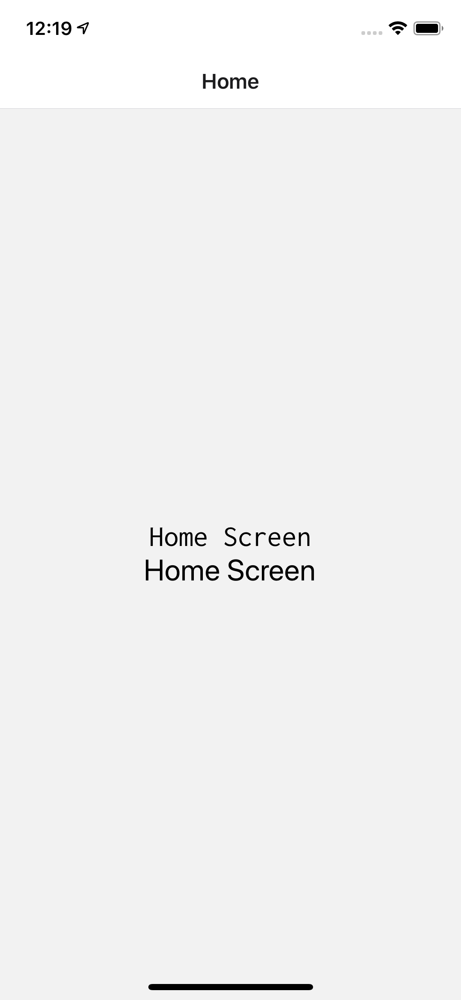

# react-native-custom-fonts
Example React native custom fonts

Custom font - Inconsolata-Regular

# To Run IOS
npx react-native run-ios

# To Run Android
npx react-native run-android

[Reference](https://medium.com/@danielskripnik/how-to-add-and-remove-custom-fonts-in-react-native-b2830084b0e4)
